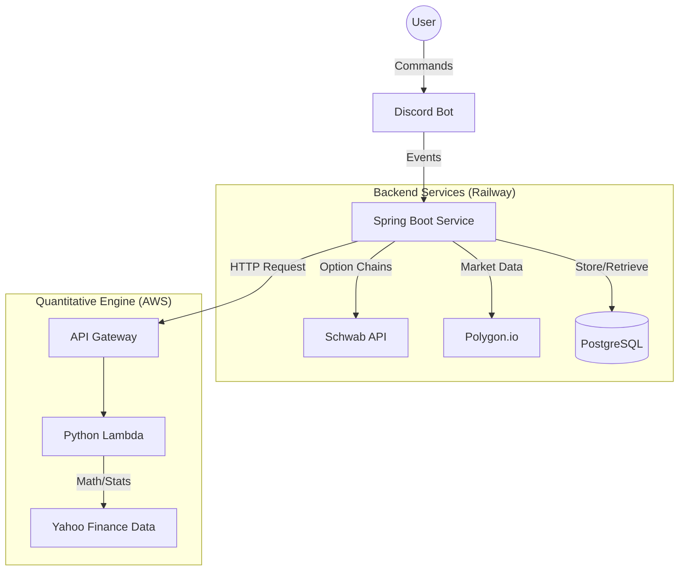

# 📈 Options Analytics & Trading Bot

**A high-performance Discord bot for real-time options analysis, strategy execution, and mean reversion signals.**

Built with **Java Spring Boot**, **AWS Lambda**, **PostgreSQL**, and the **Charles Schwab API**.

---

## 🚀 Key Features

- **Real-Time Data**: Integrates with **Charles Schwab Developer API** for execution-grade option chain data (SPX, SPY, etc.).
- **Quantitative Indicators**:
  - **Z-Score & Mean Reversion**: Calculates statistical deviations using 1-year lookback.
  - **Half-Life Estimation**: Uses Ornstein-Uhlenbeck Process (in Python/Lambda) to predict reversion time.
  - **Autocorrelation (ACF)**: Validates signal strength.
- **Discord Commands**:
  - `!strad <dte>`: Get pricing for ATM Straddles (0-3 DTE).
  - `/indicator <ticker>`: Fetch quant signals analysis.
  - `/portfolio`: Track open positions and P&L.
- **Microservices Architecture**:
  - **Core**: Java Agent (Discord/JDA + Spring Boot).
  - **Compute**: Python AWS Lambda (NumPy/Pandas) for heavy math.
  - **Database**: Railway-managed PostgreSQL.

---

## 🏗️ Architecture



---

## 🛠️ Technology Stack

- **Language**: Java 17 (Spring Boot 3), Python 3.11
- **Cloud**: AWS Lambda, Railway (PaaS)
- **Database**: PostgreSQL (Hibernate/JPA)
- **APIs**:
  - **Charles Schwab**: OAuth2-protected real-time options.
  - **Discord (JDA)**: User interface.
  - **Polygon.io**: Stock data backup.

---

## 🔧 Setup & Configuration

### Prerequisites
- Java 17+
- Maven
- Schwab Developer Account (App Key & Secret)

### Environment Variables

| Variable | Description |
|----------|-------------|
| `DISCORD_TOKEN` | Discord Bot Token |
| `SCHWAB_CLIENT_ID` | Schwab App Key |
| `SCHWAB_CLIENT_SECRET` | Schwab App Secret |
| `SCHWAB_REFRESH_TOKEN` | OAuth2 Refresh Token (7-day validity) |
| `DATABASE_URL` | PostgreSQL Connection String |
| `LAMBDA_API_KEY` | Secure key for AWS Lambda comms |

### Running Locally
```bash
# Clone the repo
git clone https://github.com/your-repo/deal-api.git

# Build with Maven
mvn clean install

# Run
java -jar target/deal-api-0.0.1-SNAPSHOT.jar
```

---

## 🔌 API Integration Details

The bot handles the complex **Schwab OAuth2 Flow**:
1. Uses a manually obtained `Refresh Token`.
2. Automatically fetches a new `Access Token` every 30 minutes.
3. Requests Option Chains via `/marketdata/v1/chains`.

*(See `SchwabApiService.java` for implementation details)*

---

## 🛡️ Security

- No API keys are committed to Git.
- Secrets are managed via **Railway Variables** and **GitHub Secrets**.
- Lambda endpoints are protected by `X-API-Key` headers.

---

## 📄 License

MIT License. Not financial advice. Use at your own risk.
